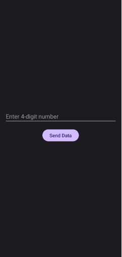

LiFi Based Login System
🌟 Project Overview
This project demonstrates a novel approach to secure login systems by leveraging Light Fidelity (LiFi) technology. We've developed a prototype featuring a 3-locker/safe system where each lock can be opened and closed using distinct lock and unlock codes transmitted via modulated light from a smartphone.

The core of the system relies on a custom-built Android application, "Velicham," which modulates the device's flashlight to encode 4-digit login credentials. This modulated light signal is then received by an LDR (Light Dependent Resistor) module, which converts the optical data into electrical signals. These signals are processed by a Clone Arduino Uno R3, which interprets the codes and controls one of three SG90 servo motors acting as the physical locks.

A 16x2 LCD display provides real-time feedback on the system's status, guiding the user through the login process and indicating states such as "Waiting for input," "Lock 3 Unlocked," "Wrong Code," "Please Wait," "Timeout," and a "Locked!" state if five incorrect codes are entered.

✨ Features
LiFi Communication: Utilizes Pulse Width Modulation (PWM) of a smartphone flashlight for secure, short-range data transmission.

Three-Tier Security: Implements a three-locker system, each with unique lock/unlock codes.

Custom Android App ("Velicham"): A dedicated application developed with Android Studio for precise light modulation and code transmission.

Real-time User Feedback: An integrated 16x2 LCD connected via an I2C module provides clear status messages during operation.

Robust Error Handling: Features comprehensive error detection including "Wrong Code," "Timeout," and a "Locked!" state after five consecutive failed attempts.

Arduino Control: Logic handled by a cost-effective Clone Arduino Uno R3 platform for accessibility and ease of development.

💡 How It Works
Here are images of the physical prototype and the LCD display in action:

The system operates on a simple, yet effective principle:

Code Transmission (Velicham App): The user enters a 4-digit code into the Velicham Android application. Each digit is converted into a specific flashlight ON duration based on a rule (e.g., 0 = 50ms, 1 = 100ms, ..., 9 = 500ms). The app blinks the flashlight in sequence, with a 50ms OFF gap between each digit.

Light Reception (LDR Module): An LDR module detects these precise flashlight pulses. The varying light intensity changes the LDR's resistance, which is then converted into a digital signal processed by the Arduino.

Data Processing (Arduino Uno R3): The Arduino continuously monitors the LDR's digital output, measuring the ON durations. It then maps these durations back to the corresponding digits, reconstructing the original 4-digit code.

Lock Control (Servo Motors): Based on the decoded code, the Arduino verifies it against pre-defined authentication keys. If the code is correct, the corresponding SG90 servo motor rotates 180 degrees to an "unlocked" position. After a predefined time (e.g., 5 seconds), the servo returns to its locked position (0 degrees).

Status Display (LCD): The 16x2 LCD connected to the Arduino provides immediate visual feedback, displaying messages like "Waiting for Input," "Access Granted - Safe Unlocked," "Access Denied - Invalid Code," "Timeout," and the "Locked! Wait Xs" message during temporary lockouts.

Security Measures: The system includes logic to increment a counter for wrong code entries. If 5 incorrect codes are entered consecutively, the system enters a temporary lockout state (e.g., 30 seconds) to prevent brute-force attacks.

🛠️ Hardware Components
Here's a list of the key components used in this project:

Smartphone: Any Android smartphone capable of controlling its flashlight programmatically.

LDR Module: Used to detect and convert modulated light signals.

Pinout: VCC (3.3V), GND, DO (Data Output)

Clone Arduino Uno R3 (CH340): The central microcontroller.

Pin usage: Digital I/O for LDR, PWM pins for Servos, I2C pins (A4, A5) for LCD.

SG90 Servo Motors (x3): Act as the physical locking mechanisms.

Pinout: VCC (5V), GND, Signal (GPIO)

16x2 LCD Display: For real-time status updates.

I2C Module: Interfaces the LCD with the Arduino, reducing pin usage.

Pinout: VCC (5V), GND, SDA (Serial Data), SCL (Serial Clock)

12V, 1A Power Adapter: Supplies stable power to the Arduino and components.

Mini-Breadboard: For prototyping circuit connections.

Jumper Wires: For electrical connections.

Forex Sheet (70cm x 70cm): Used as the structural framework for the prototype.

Tools: Soldering Iron and Solder, Wire Cutters and Strippers, Multimeter.

💻 Software Components
Velicham Android Application:

Developed using Android Studio and Kotlin.

Handles user input, converts digits to light pulse durations, and controls the flashlight.

App UI:

Light Encoding Rule:

0 -> 50ms ON

1 -> 100ms ON

2 -> 150ms ON

3 -> 200ms ON

4 -> 250ms ON

5 -> 300ms ON

6 -> 350ms ON

7 -> 400ms ON

8 -> 450ms ON

9 -> 500ms ON

50ms OFF gap between each digit.

Arduino Sketch (Firmware):

Written in C++ using the Arduino IDE.

Manages input from the LDR, decodes light signals based on duration, controls servo motors, and updates the LCD display.

Implements timeout and lockout mechanisms for security.

🚀 Getting Started
To replicate and run this project:

Clone the Repository:

git clone https://github.com/kesavsp04/lifi-login-system.git

Hardware Setup:

Assemble the LDR module, three SG90 servo motors, and the 16x2 LCD (with I2C module) with the Arduino Uno R3 as shown in the provided circuit diagram. Ensure correct power connections from the 12V adapter.

Arduino IDE Setup:

Install the Arduino IDE.

Open the Arduino sketch from the repository (you will find it as lifi-based-login.ino in the arduino-code/ folder).

Install necessary libraries: LiquidCrystal_I2C and Servo.

Upload the sketch to your Arduino Uno R3.

Smartphone App Setup:

The compiled Velicham APK can be found in the android-app/ folder (e.g., android-app/Velicham-v1.0.apk) for direct installation on an Android device.

To work with the source code, open the Android Studio project for the Velicham app from the repository (it's located in the android-app/Velicham/ folder).

Build and install the APK on your Android device. Ensure camera permission is granted for flashlight control.

Testing:

Power up the Arduino system.

Use the Velicham app to transmit 4-digit codes towards the LDR module.

Observe the servo motor actions and LCD output for successful authentication, wrong codes, timeouts, and lockouts.

🤝 Contributing
We welcome contributions to enhance this project! If you have ideas for improvements, bug fixes, or new features, please feel free to:

Fork this repository.

Create a new branch (git checkout -b feature/AmazingFeature).

Commit your changes (git commit -m 'Add some AmazingFeature').

Push to the branch (git push origin feature/AmazingFeature).

Open a Pull Request.
