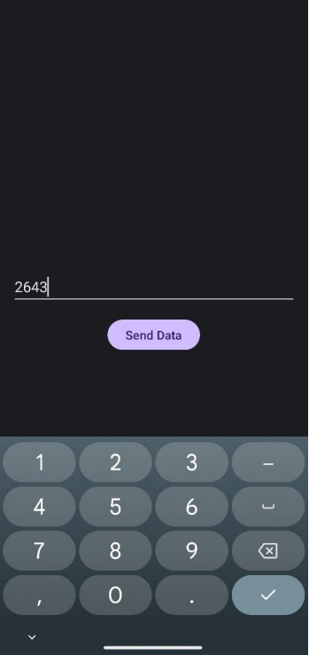
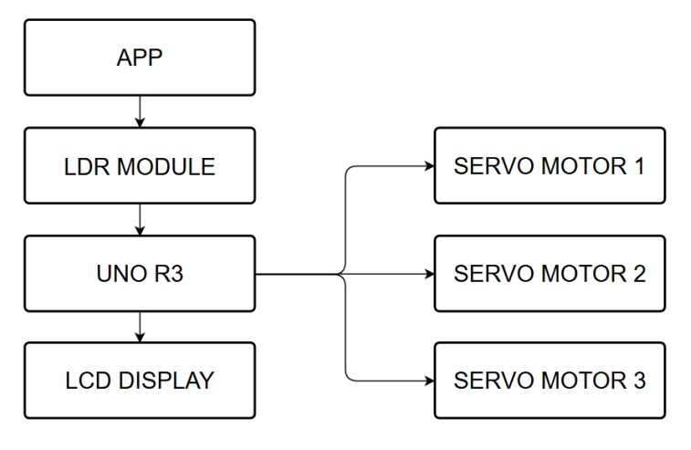
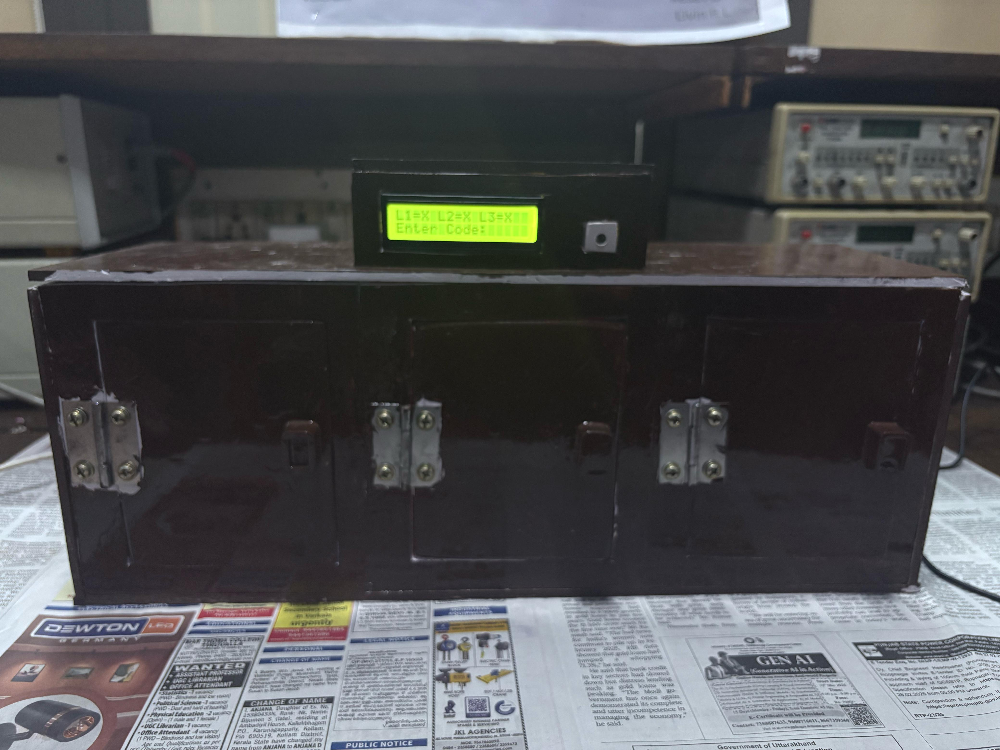

# 🔐 LiFi Based Login System

## 🌟 Project Overview

This project demonstrates a novel approach to secure login systems by leveraging **Light Fidelity (LiFi)** technology.
We developed a **3-locker/safe prototype** where each lock can be controlled using distinct lock/unlock codes transmitted via modulated light from a smartphone.

The core of the system is powered by:

* A custom Android app **Velicham**, which modulates the flashlight to encode 4-digit login credentials.
* An **LDR module** that receives the signal and passes it to a **Clone Arduino Uno R3**.
* **SG90 Servo motors** acting as locks, controlled by the Arduino.
* A **16x2 LCD with I2C** for real-time system feedback.

---

## ✨ Features

* **LiFi Communication**: Secure, short-range data transmission using PWM flashlight modulation.
* **Three-Tier Security**: 3 independent lockers, each with unique codes.
* **Custom Android App (Velicham)**: Built with Android Studio & Kotlin for precision light modulation.
* **Real-time User Feedback**: LCD shows system status ("Waiting", "Unlocked", "Wrong Code", etc.).
* **Robust Error Handling**: Wrong code, timeout, and lockout mechanisms.
* **Arduino Based**: Powered by a Clone Arduino Uno R3 for cost-effectiveness and accessibility.


---

## 💡 How It Works

1. **Code Transmission (Velicham App)**

   * User enters a 4-digit code.
   * Each digit → flashlight ON duration (0=50ms, 1=100ms, …, 9=500ms).
   * 50ms OFF gap between digits.

   

2. **Light Reception (LDR Module)**

   * Detects flashlight pulses.
   * Converts light intensity into resistance → electrical signals.


3. **Data Processing (Arduino Uno R3)**

   * Measures ON durations.
   * Maps durations → digits.
   * Reconstructs the 4-digit code.


4. **Lock Control (Servo Motors)**

   * If code matches → corresponding SG90 servo rotates to unlock (180°).
   * After 5s → auto return to locked position (0°).


5. **Status Display (LCD)**

   * Messages:

     * `Waiting for Input`
     * `Safe X Unlocked`
     * `Wrong Code`
     * `Timeout`
     * `Locked! Wait Xs`


6. **Security Measures**

   * Wrong attempts counter.
   * 5 failed codes → system lockout for 30s.

## 📊 Block Diagram




---

## 🛠️ Hardware Components


* **Smartphone** (Android, flashlight controllable)  
* **LDR Module** (VCC, GND, DO pins)  
* **Clone Arduino Uno R3 (CH340)**  
* **SG90 Servo Motors (x3)** (VCC, GND, Signal)  
* **16x2 LCD with I2C module** (VCC, GND, SDA, SCL)  
* **12V, 1A Power Adapter**  
* **Mini Breadboard + Jumper Wires**  
* **Forex Sheet (70cm x 70cm)** → prototype frame  
* **Tools**: Soldering iron, wire cutters, multimeter  

---

## 💻 Software Components

### Velicham Android App


* Built in **Android Studio (Kotlin)**
* Converts digits → flashlight pulses
* Controls flashlight with precise ON/OFF durations

**Digit Encoding Rule**:

```

0 -> 50ms ON
1 -> 100ms ON
2 -> 150ms ON
3 -> 200ms ON
4 -> 250ms ON
5 -> 300ms ON
6 -> 350ms ON
7 -> 400ms ON
8 -> 450ms ON
9 -> 500ms ON
(50ms OFF gap between digits)

````

### Arduino Sketch (Firmware)


* Written in **C++ with Arduino IDE**
* Handles:

  * LDR input decoding
  * Servo motor control
  * LCD updates
  * Timeout + Lockout logic

**Required Libraries**:

* `LiquidCrystal_I2C`  
* `Servo`  

---

## 🚀 Getting Started

### Clone the Repository

```bash
git clone https://github.com/kesavsp04/lifi-login-system.git
````

### Hardware Setup


* Connect **LDR → Arduino digital pin**
* Connect **3x SG90 Servos → PWM pins**
* Connect **LCD (I2C) → SDA=A4, SCL=A5**
* Power system with **12V adapter**

### Arduino IDE Setup

1. Install Arduino IDE
2. Open sketch: `arduino-code/lifi-based-login.ino`
3. Install required libraries (`LiquidCrystal_I2C`, `Servo`)
4. Upload to Arduino Uno R3

### Android App Setup


* Install prebuilt APK: `android-app/Velicham-v1.0.apk`
* Or open `android-app/Velicham/` in Android Studio → Build & Install
* Grant **Camera permission** for flashlight control

### Testing


1. Power up Arduino system.
2. Open Velicham app → enter code → transmit via flashlight.
3. Observe:

   * ✅ Correct code → Servo unlocks safe
   * ❌ Wrong code → LCD shows "Wrong Code"
   * ⏳ Timeout → LCD shows "Timeout"
   * 🔒 5 wrong codes → Lockout for 30s

---

## 📸 Prototype & UI

* **Velicham App UI**
  

* **LCD & Hardware Prototype**
  

---

## 🤝 Contributing

We welcome contributions! 🚀

1. Fork repo
2. Create feature branch (`git checkout -b feature/AmazingFeature`)
3. Commit changes (`git commit -m 'Add AmazingFeature'`)
4. Push branch (`git push origin feature/AmazingFeature`)
5. Open Pull Request
